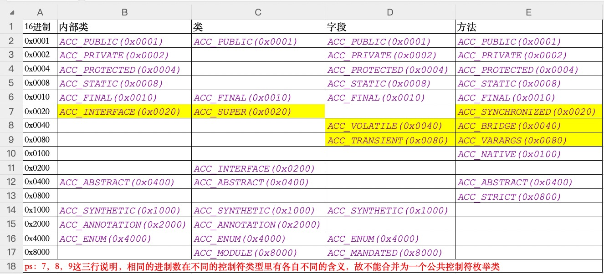

# java byte-code parser

java 字节码解析器

有了字节码解析器，可以做2件事情，反编译器和字节码解释器。

## 参考

- 官方文档[《Java虚拟机规范》第四章：字节码文件格式](https://docs.oracle.com/javase/specs/jvms/se8/html/jvms-4.html) 
- 周志明[《深入理解Java虚拟机(第3版)》](https://book.douban.com/subject/34907497/)

## 用法

```java
public static void main(String[] args) {
    try(InputStream is = Files.newInputStream(new File("class文件路径").toPath())){
        ClassByteCode classByteCode = new ByteCodeParser().parser(is);
        System.out.println(classByteCode);
    }
}
```

`ParseTheClassByteCode.java`为一个较完整的demo文件。

`ByteCodeParser.java`的`parser(InputStream is)`方法为解析器总入口，将字节码文件流传入即可。

 **需要注意的是解析器传入的是文件流，解析完成记得关闭文件流，可以使用`try-with-resources`写法。** 

该解析器设计采用了嵌套模型，解析器内部嵌套了解析器，会多次调用相同解析器，故内部使用了`ParserCache.getParser()`缓存机制。

## 关于访问控制符

因为java存在多种访问控制类型，故使用了多个枚举来表示，
- `ClassAccessFlagEnum.java`
- `FieldAccessFlagEnum.java`
- `InnerClassAccessFlagEnum.java`
- `MethodAccessFlagEnum.java`

原因如下图：


